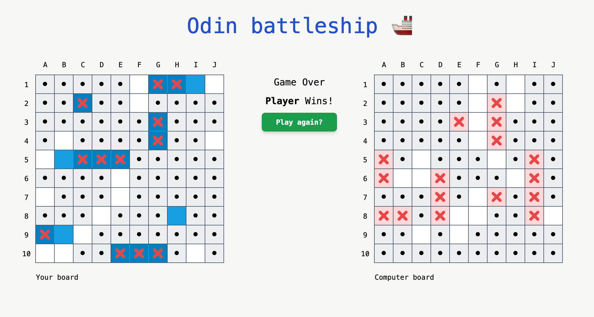

# Battleship Game Project

## Overview

Developed as part of The Odin Project's JavaScript [course](https://www.theodinproject.com/lessons/javascript-battleship). Classic game of battleship [(rules)](<https://en.wikipedia.org/wiki/Battleship_(game)>).

## Live preview: https://mantesso.github.io/odin-battleship/

## Concepts worked

- Object-Oriented Programming (OOP)
- Test-Driven Development (TDD). Tests written with jest (except DOM).
- Working with 2d Arrays and Objects.
- Challanged myself to add a "buffer zone" to ships so they can't be placed adjacent to each other.
- Usage of a [backtracking algorithm](https://en.wikipedia.org/wiki/Backtracking) to place the ships randomly on the board.
- Usage of the [HTML Drag and Drop API](https://developer.mozilla.org/en-US/docs/Web/API/HTML_Drag_and_Drop_API)
- webpack for bundling.
- TailwindCSS for styling.

## Building and Running the Project

- Requires Node.js installed on your system.
- In the project directory in your terminal and run `npm install` to install required dependencies.
- Run `npm run build` to bundle the project using webpack and `npm run dev` to run the project locally.
- The project will be available on port `http://localhost:3000/`

## Run a dockerized version of the project

- Pull Image: `docker pull mantesso/odin-battleship`
- Run the Container: `docker run -p 3000:3000 mantesso/odin-battleship`
- The project will be available on `http://localhost:3000/`